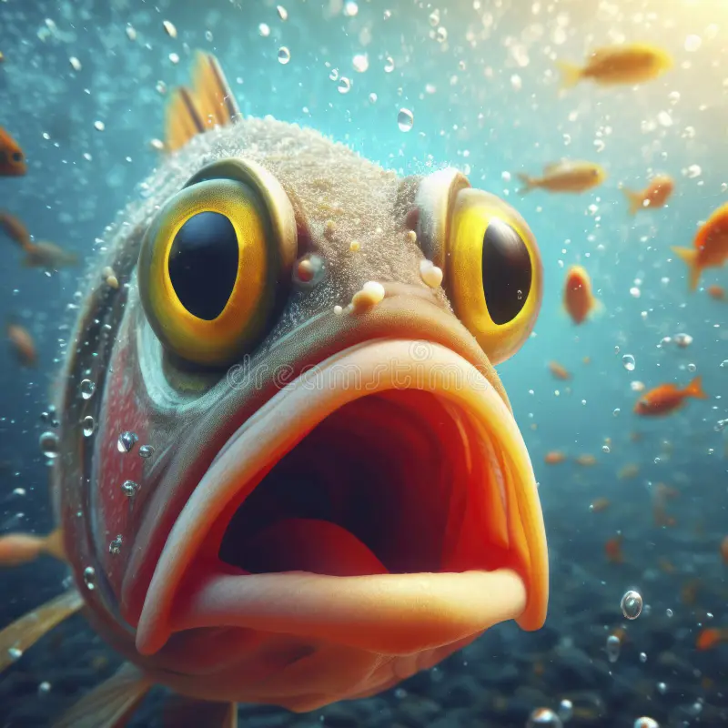

# Marine Life
### DDU themed pilot project
Currently, we are working on a project, 
that raises awareness about ocean life. 
Did you know that about 71% of the earth's surface is covered in water, 
and that we have only explored 5% of it? 

As we know, 
fish live in the ocean across the globe. 
With the perfect water temperature and pH value of water, 
fish and coral reefs and easily thrive. 

But that is not entirely true......

....To be continued